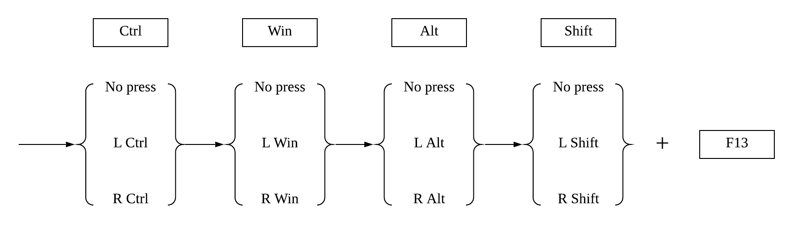

# 1 to 80 Magic
 This repo contains the codes of 1 to 80 magic.

 

|   No. | >^ R_CTRL | ># R_GUI | >! R_ALT | >+ R_SHIFT | <^ L_CTRL | <# L_GUI | <! L_ALT | <+ L_SHIFT | AHK KEY_F13 |  Remarks                   |
|:-----:|:---------:|:--------:|:--------:|:----------:|:---------:|:--------:|:--------:|:----------:|:-----------:|:--------------------------:|
|   1   |     0     |     0    |     0    |      0     |     0     |     0    |     0    |      0     |     F13     |             F13            |
|   2   |     0     |     0    |     0    |      0     |     0     |     0    |     0    |      1     |    <+F13    |         LShift-F13         |
|   3   |     0     |     0    |     0    |      0     |     0     |     0    |     1    |      0     |    <!F13    |          LAlt-F13          |
|   4   |     0     |     0    |     0    |      0     |     0     |     1    |     0    |      0     |    <#F13    |          LWin-F13          |
|   5   |     0     |     0    |     0    |      0     |     1     |     0    |     0    |      0     |    <^F13    |          LCtrl-F13         |
|   6   |     0     |     0    |     0    |      1     |     0     |     0    |     0    |      0     |    >+F13    |         RShift-F13         |
|   7   |     0     |     0    |     1    |      0     |     0     |     0    |     0    |      0     |    >!F13    |          RAlt-F13          |
|   8   |     0     |     1    |     0    |      0     |     0     |     0    |     0    |      0     |    >#F13    |          RWin-F13          |
|   9   |     1     |     0    |     0    |      0     |     0     |     0    |     0    |      0     |    >^F13    |          RCtrl-F13         |
|   10  |     0     |     0    |     0    |      0     |     0     |     0    |     1    |      1     |   <!<+F13   |       LAlt-LShift-F13      |
|   11  |     0     |     0    |     0    |      0     |     0     |     1    |     0    |      1     |   <#<+F13   |       LWin-LShift-F13      |
|   12  |     0     |     0    |     0    |      0     |     0     |     1    |     1    |      0     |   <#<!F13   |        LWin-LAlt-F13       |
|   13  |     0     |     0    |     0    |      0     |     1     |     0    |     0    |      1     |   <^<+F13   |      LCtrl-LShift-F13      |
|   14  |     0     |     0    |     0    |      0     |     1     |     0    |     1    |      0     |   <^<!F13   |       LCtrl-LAlt-F13       |
|   15  |     0     |     0    |     0    |      0     |     1     |     1    |     0    |      0     |   <^<#F13   |       LCtrl-LWin-F13       |
|   16  |     0     |     0    |     0    |      1     |     0     |     0    |     1    |      0     |   <!>+F13   |       LAlt-RShift-F13      |
|   17  |     0     |     0    |     0    |      1     |     0     |     1    |     0    |      0     |   <#>+F13   |       LWin-RShift-F13      |
|   18  |     0     |     0    |     0    |      1     |     1     |     0    |     0    |      0     |   <^>+F13   |      LCtrl-RShift-F13      |
|   19  |     0     |     0    |     1    |      0     |     0     |     0    |     0    |      1     |   >!<+F13   |       RAlt-LShift-F13      |
|   20  |     0     |     0    |     1    |      0     |     0     |     1    |     0    |      0     |   <#>!F13   |        LWin-RAlt-F13       |
|   21  |     0     |     0    |     1    |      0     |     1     |     0    |     0    |      0     |   <^>!F13   |       LCtrl-RAlt-F13       |
|   22  |     0     |     0    |     1    |      1     |     0     |     0    |     0    |      0     |   >!>+F13   |       RAlt-RShift-F13      |
|   23  |     0     |     1    |     0    |      0     |     0     |     0    |     0    |      1     |   >#<+F13   |       RWin-LShift-F13      |
|   24  |     0     |     1    |     0    |      0     |     0     |     0    |     1    |      0     |   >#<!F13   |        RWin-LAlt-F13       |
|   25  |     0     |     1    |     0    |      0     |     1     |     0    |     0    |      0     |   <^>#F13   |       LCtrl-RWin-F13       |
|   26  |     0     |     1    |     0    |      1     |     0     |     0    |     0    |      0     |   >#>+F13   |       RWin-RShift-F13      |
|   27  |     0     |     1    |     1    |      0     |     0     |     0    |     0    |      0     |   >#>!F13   |        RWin-RAlt-F13       |
|   28  |     1     |     0    |     0    |      0     |     0     |     0    |     0    |      1     |   >^<+F13   |      RCtrl-LShift-F13      |
|   29  |     1     |     0    |     0    |      0     |     0     |     0    |     1    |      0     |   >^<!F13   |       RCtrl-LAlt-F13       |
|   30  |     1     |     0    |     0    |      0     |     0     |     1    |     0    |      0     |   >^<#F13   |       RCtrl-LWin-F13       |
|   31  |     1     |     0    |     0    |      1     |     0     |     0    |     0    |      0     |   >^>+F13   |      RCtrl-RShift-F13      |
|   32  |     1     |     0    |     1    |      0     |     0     |     0    |     0    |      0     |   >^>!F13   |       RCtrl-RAlt-F13       |
|   33  |     1     |     1    |     0    |      0     |     0     |     0    |     0    |      0     |   >^>#F13   |       RCtrl-RWin-F13       |
|   34  |     0     |     0    |     0    |      0     |     0     |     1    |     1    |      1     |  <#<!<+F13  |    LWin-LAlt-LShift-F13    |
|   35  |     0     |     0    |     0    |      0     |     1     |     0    |     1    |      1     |  <^<!<+F13  |    LCtrl-LAlt-LShift-F13   |
|   36  |     0     |     0    |     0    |      0     |     1     |     1    |     0    |      1     |  <^<#<+F13  |    LCtrl-LWin-LShift-F13   |
|   37  |     0     |     0    |     0    |      0     |     1     |     1    |     1    |      0     |  <^<#<!F13  |     LCtrl-LWin-LAlt-F13    |
|   38  |     0     |     0    |     0    |      1     |     0     |     1    |     1    |      0     |  <#<!>+F13  |    LWin-LAlt-RShift-F13    |
|   39  |     0     |     0    |     0    |      1     |     1     |     0    |     1    |      0     |  <^<!>+F13  |    LCtrl-LAlt-RShift-F13   |
|   40  |     0     |     0    |     0    |      1     |     1     |     1    |     0    |      0     |  <^<#>+F13  |    LCtrl-LWin-RShift-F13   |
|   41  |     0     |     0    |     1    |      0     |     0     |     1    |     0    |      1     |  <#>!<+F13  |    LWin-RAlt-LShift-F13    |
|   42  |     0     |     0    |     1    |      0     |     1     |     0    |     0    |      1     |  <^>!<+F13  |    LCtrl-RAlt-LShift-F13   |
|   43  |     0     |     0    |     1    |      0     |     1     |     1    |     0    |      0     |  <^<#>!F13  |     LCtrl-LWin-RAlt-F13    |
|   44  |     0     |     0    |     1    |      1     |     0     |     1    |     0    |      0     |  <#>!>+F13  |    LWin-RAlt-RShift-F13    |
|   45  |     0     |     0    |     1    |      1     |     1     |     0    |     0    |      0     |  <^>!>+F13  |    LCtrl-RAlt-RShift-F13   |
|   46  |     0     |     1    |     0    |      0     |     0     |     0    |     1    |      1     |  >#<!<+F13  |    RWin-LAlt-LShift-F13    |
|   47  |     0     |     1    |     0    |      0     |     1     |     0    |     0    |      1     |  <^>#<+F13  |    LCtrl-RWin-LShift-F13   |
|   48  |     0     |     1    |     0    |      0     |     1     |     0    |     1    |      0     |  <^>#<!F13  |     LCtrl-RWin-LAlt-F13    |
|   49  |     0     |     1    |     0    |      1     |     0     |     0    |     1    |      0     |  >#<!>+F13  |    RWin-LAlt-RShift-F13    |
|   50  |     0     |     1    |     0    |      1     |     1     |     0    |     0    |      0     |  <^>#>+F13  |    LCtrl-RWin-RShift-F13   |
|   51  |     0     |     1    |     1    |      0     |     0     |     0    |     0    |      1     |  >#>!<+F13  |    RWin-RAlt-LShift-F13    |
|   52  |     0     |     1    |     1    |      0     |     1     |     0    |     0    |      0     |  <^>#>!F13  |     LCtrl-RWin-RAlt-F13    |
|   53  |     0     |     1    |     1    |      1     |     0     |     0    |     0    |      0     |  >#>!>+F13  |    RWin-RAlt-RShift-F13    |
|   54  |     1     |     0    |     0    |      0     |     0     |     0    |     1    |      1     |  >^<!<+F13  |    RCtrl-LAlt-LShift-F13   |
|   55  |     1     |     0    |     0    |      0     |     0     |     1    |     0    |      1     |  >^<#<+F13  |    RCtrl-LWin-LShift-F13   |
|   56  |     1     |     0    |     0    |      0     |     0     |     1    |     1    |      0     |  >^<#<!F13  |     RCtrl-LWin-LAlt-F13    |
|   57  |     1     |     0    |     0    |      1     |     0     |     0    |     1    |      0     |  >^<!>+F13  |    RCtrl-LAlt-RShift-F13   |
|   58  |     1     |     0    |     0    |      1     |     0     |     1    |     0    |      0     |  >^<#>+F13  |    RCtrl-LWin-RShift-F13   |
|   59  |     1     |     0    |     1    |      0     |     0     |     0    |     0    |      1     |  >^>!<+F13  |    RCtrl-RAlt-LShift-F13   |
|   60  |     1     |     0    |     1    |      0     |     0     |     1    |     0    |      0     |  >^<#>!F13  |     RCtrl-LWin-RAlt-F13    |
|   61  |     1     |     0    |     1    |      1     |     0     |     0    |     0    |      0     |  >^>!>+F13  |    RCtrl-RAlt-RShift-F13   |
|   62  |     1     |     1    |     0    |      0     |     0     |     0    |     0    |      1     |  >^>#<+F13  |    RCtrl-RWin-LShift-F13   |
|   63  |     1     |     1    |     0    |      0     |     0     |     0    |     1    |      0     |  >^>#<!F13  |     RCtrl-RWin-LAlt-F13    |
|   64  |     1     |     1    |     0    |      1     |     0     |     0    |     0    |      0     |  >^>#>+F13  |    RCtrl-RWin-RShift-F13   |
|   65  |     1     |     1    |     1    |      0     |     0     |     0    |     0    |      0     |  >^>#>!F13  |     RCtrl-RWin-RAlt-F13    |
|   66  |     0     |     0    |     0    |      0     |     1     |     1    |     1    |      1     | <^<#<!<+F13 | LCtrl-LWin-LAlt-LShift-F13 |
|   67  |     0     |     0    |     0    |      1     |     1     |     1    |     1    |      0     | <^<#<!>+F13 | LCtrl-LWin-LAlt-RShift-F13 |
|   68  |     0     |     0    |     1    |      0     |     1     |     1    |     0    |      1     | <^<#>!<+F13 | LCtrl-LWin-RAlt-LShift-F13 |
|   69  |     0     |     0    |     1    |      1     |     1     |     1    |     0    |      0     | <^<#>!>+F13 | LCtrl-LWin-RAlt-RShift-F13 |
|   70  |     0     |     1    |     0    |      0     |     1     |     0    |     1    |      1     | <^>#<!<+F13 | LCtrl-RWin-LAlt-LShift-F13 |
|   71  |     0     |     1    |     0    |      1     |     1     |     0    |     1    |      0     | <^>#<!>+F13 | LCtrl-RWin-LAlt-RShift-F13 |
|   72  |     0     |     1    |     1    |      0     |     1     |     0    |     0    |      1     | <^>#>!<+F13 | LCtrl-RWin-RAlt-LShift-F13 |
|   73  |     0     |     1    |     1    |      1     |     1     |     0    |     0    |      0     | <^>#>!>+F13 | LCtrl-RWin-RAlt-RShift-F13 |
|   74  |     1     |     0    |     0    |      0     |     0     |     1    |     1    |      1     | >^<#<!<+F13 | RCtrl-LWin-LAlt-LShift-F13 |
|   75  |     1     |     0    |     0    |      1     |     0     |     1    |     1    |      0     | >^<#<!>+F13 | RCtrl-LWin-LAlt-RShift-F13 |
|   76  |     1     |     0    |     1    |      0     |     0     |     1    |     0    |      1     | >^<#>!<+F13 | RCtrl-LWin-RAlt-LShift-F13 |
|   77  |     1     |     0    |     1    |      1     |     0     |     1    |     0    |      0     | >^<#>!>+F13 | RCtrl-LWin-RAlt-RShift-F13 |
|   78  |     1     |     1    |     0    |      0     |     0     |     0    |     1    |      1     | >^>#<!<+F13 | RCtrl-RWin-LAlt-LShift-F13 |
|   79  |     1     |     1    |     0    |      1     |     0     |     0    |     1    |      0     | >^>#<!>+F13 | RCtrl-RWin-LAlt-RShift-F13 |
|   80  |     1     |     1    |     1    |      0     |     0     |     0    |     0    |      1     | >^>#>!<+F13 | RCtrl-RWin-RAlt-LShift-F13 |
|   81  |     1     |     1    |     1    |      1     |     0     |     0    |     0    |      0     | >^>#>!>+F13 | RCtrl-RWin-RAlt-RShift-F13 |